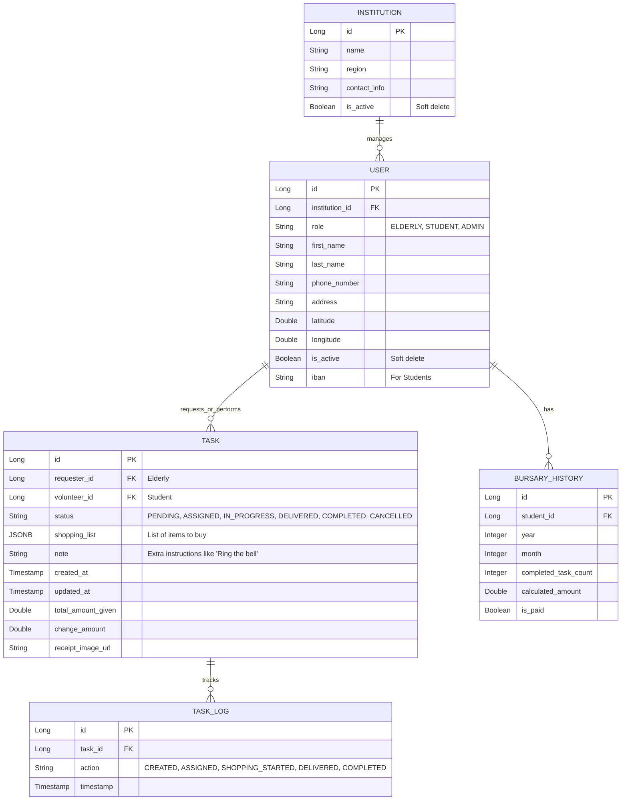

# Veritabanı Şeması (PostgreSQL)

Proje için önerilen **İlişkisel Veritabanı (Relational Database)** tasarımı aşağıdadır. Kullanıcı geri bildirimi üzerine alışveriş listesi metin/JSON olarak revize edilmiştir.

## ER Diyagramı

## Tablo Detayları

### 1. `institutions` (Kurumlar)
Kurumların (Belediye, STK vb.) tutulduğu tablo.
- `id`: Primary Key
- `name`: Kurum adı
- `region`: Sorumlu olduğu bölge (İl/İlçe)
- `contact_info`: İletişim bilgileri
- `is_active`: Kurum pasife alınırsa işlem yapamaz (Soft Delete).

### 2. `users` (Kullanıcılar)
Tüm kullanıcı rollerini tek tabloda tutuyoruz (Single Table).
- `id`: Primary Key
- `institution_id`: Hangi kuruma bağlı olduğu (Foreign Key).
- `role`: Kullanıcının rolü (`STUDENT`, `ELDERLY`, `INSTITUTION_ADMIN`).
- `first_name`, `last_name`: Ad Soyad.
- `phone_number`: İletişim numarası (Login ve bildirimler için önemli).
- `address`: Açık adres.
- `latitude`, `longitude`: Konum tabanlı eşleşme için koordinatlar (PostGIS kullanılabilir).
- `is_active`: Kullanıcı hesabını kapatırsa veya dondurursa false olur (Soft Delete).
- `iban`: Sadece öğrenciler için, burs ödemesi yapılacak hesap no.

### 3. `bursary_history` (Burs Geçmişi ve Hakedişler)
Öğrencilerin aylık performanslarının ve burs ödemelerinin tutulduğu tablo.
- **Neden var?** `Users` tablosunda sadece tek bir rakam tutarsak ("Bu ay 3 yaptı"), ay bittiğinde bu veriyi kaybederiz. Geçmişe dönük "Ocak ayında kaç yaptı? Parasını aldı mı?" takibi için bu tablo şarttır.
- `student_id`: Hangi öğrenci?
- `year`: Hangi yıl (Örn: 2024).
- `month`: Hangi ay (Örn: 2).
- `completed_task_count`: O ay tamamladığı görev sayısı. (Otomatik hesaplanıp buraya yazılır).
- `calculated_amount`: Hak ettiği burs miktarı.
- `is_paid`: Ödeme yapıldı mı?

### 4. `tasks` (Görevler / Alışveriş İstekleri)
Ana işlem tablosu.
- `id`: Primary Key
- `requester_id`: İsteyen yaşlı/engelli (User FK).
- `volunteer_id`: Atanan öğrenci (User FK). Başlangıçta NULL olabilir.
- `status`: Görevin anlık durumu.
    - `PENDING`: İstek oluşturuldu, öğrenci aranıyor.
    - `ASSIGNED`: Öğrenci kabul etti, yolda.
    - `AT_HOME_INITIAL`: Öğrenci eve vardı, parayı ve listeyi teyit ediyor.
    - `SHOPPING`: Öğrenci alışverişte.
    - `AT_HOME_FINAL`: Öğrenci döndü, teslimat yapıyor.
    - `COMPLETED`: Her şey tamamlandı.
    - `CANCELLED`: İptal edildi.
- `shopping_list`: Alınacak ürünlerin listesi. JSONB formatında tutulur.
    - Örnek Veri: `[{"item": "Ekmek", "qty": 2, "unit": "Adet"}, {"item": "Süt", "qty": 1, "unit": "Lt"}]`
- `note`: Yaşlının eklediği notlar (Örn: "Zili çalmayın", "Geldiginde ara").
- `created_at`, `updated_at`: Kayıt oluşturulma ve güncelleme tarihleri.
- `total_amount_given`: Yaşlının öğrenciye teslim ettiği para (Örn: 100 TL).
- `change_amount`: Alışveriş sonrası artan para üstü (Örn: 10 TL).
- `receipt_image_url`: Yüklenen alışveriş fişinin dosya yolu/URL'i.

### 5. `task_logs` (İşlem Geçmişi)
Bir görevin durum değişikliklerini loglamak için (Audit trail). Güvenlik ve itiraz durumları için önemlidir.
- `id`: Primary Key
- `task_id`: Hangi göreve ait olduğu.
- `action`: Yapılan işlem (Örn: `SHOPPING_STARTED`).
- `timestamp`: İşlem zamanı.
