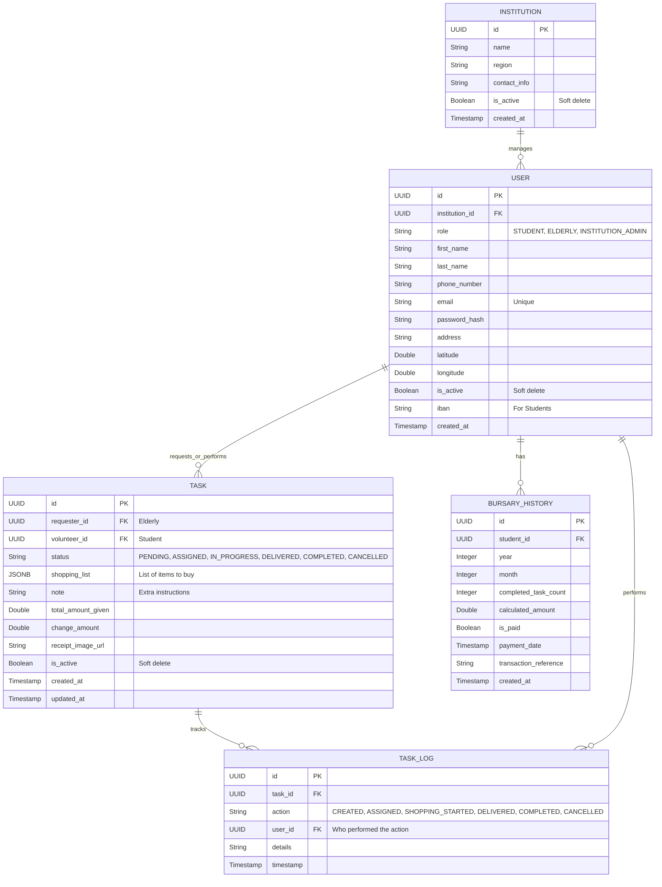

# Veritabanı Şeması (PostgreSQL)

Proje için **İlişkisel Veritabanı (Relational Database)** tasarımı aşağıdadır. Kullanıcı geri bildirimi üzerine alışveriş listesi metin/JSON olarak revize edilmiştir.

## ER Diyagramı

## Tablo Detayları

### 1. `institutions` (Kurumlar)
Kurumların (Belediye, STK vb.) tutulduğu tablo.
- `id`: Primary Key (UUID)
- `name`: Kurum adı
- `region`: Sorumlu olduğu bölge (İl/İlçe)
- `contact_info`: İletişim bilgileri
- `is_active`: Kurum pasife alınırsa işlem yapamaz (Soft Delete).
- `created_at`: Kayıt tarihi.

### 2. `users` (Kullanıcılar)
Tüm kullanıcı rollerini tek tabloda tutuyoruz (Single Table).
- `id`: Primary Key (UUID)
- `institution_id`: Hangi kuruma bağlı olduğu (Foreign Key).
- `role`: Kullanıcının rolü (`STUDENT`, `ELDERLY`, `INSTITUTION_ADMIN`).
- `first_name`, `last_name`: Ad Soyad.
- `phone_number`: İletişim numarası.
- `email`: E-posta adresi (Unique, Login için).
- `password_hash`: Şifre hash'i.
- `address`: Açık adres.
- `latitude`, `longitude`: Konum tabanlı eşleşme için koordinatlar.
- `is_active`: Kullanıcı hesabını kapatırsa veya dondurursa false olur (Soft Delete).
- `iban`: Sadece öğrenciler için, burs ödemesi yapılacak hesap no.
- `created_at`: Kayıt tarihi.

### 3. `bursary_history` (Burs Geçmişi ve Hakedişler)
Öğrencilerin aylık performanslarının ve burs ödemelerinin tutulduğu tablo.
- `id`: Primary Key (UUID)
- `student_id`: Hangi öğrenci? (User FK)
- `year`: Hangi yıl (Örn: 2024).
- `month`: Hangi ay (Örn: 2).
- `completed_task_count`: O ay tamamladığı görev sayısı.
- `calculated_amount`: Hak ettiği burs miktarı.
- `is_paid`: Ödeme yapıldı mı?
- `payment_date`: Ödeme tarihi.
- `transaction_reference`: Banka dekont/referans no.
- `created_at`: Kayıt tarihi.

### 4. `tasks` (Görevler / Alışveriş İstekleri)
Ana işlem tablosu.
- `id`: Primary Key (UUID)
- `requester_id`: İsteyen yaşlı/engelli (User FK).
- `volunteer_id`: Atanan öğrenci (User FK). Başlangıçta NULL olabilir.
- `status`: Görevin anlık durumu.
    - `PENDING`: İstek oluşturuldu, öğrenci aranıyor.
    - `ASSIGNED`: Öğrenci kabul etti.
    - `IN_PROGRESS`: İşlem devam ediyor (Alışverişte vs.).
    - `DELIVERED`: Teslim edildi.
    - `COMPLETED`: Tamamlandı (Onaylandı).
    - `CANCELLED`: İptal edildi.
- `shopping_list`: Alınacak ürünlerin listesi. JSONB formatında tutulur (`List<String>`).
- `note`: Yaşlının eklediği notlar.
- `total_amount_given`: Yaşlının öğrenciye teslim ettiği para.
- `change_amount`: Alışveriş sonrası artan para üstü.
- `receipt_image_url`: Yüklenen alışveriş fişinin dosya yolu/URL'i.
- `is_active`: Soft delete için (True/False).
- `created_at`, `updated_at`: Kayıt oluşturulma ve güncelleme tarihleri.

### 5. `task_logs` (İşlem Geçmişi)
Bir görevin durum değişikliklerini loglamak için (Audit trail).
- `id`: Primary Key (UUID)
- `task_id`: Hangi göreve ait olduğu (Task FK).
- `action`: Yapılan işlem (`CREATED`, `ASSIGNED`, `SHOPPING_STARTED`, `DELIVERED`, `COMPLETED`, `CANCELLED`).
- `user_id`: İşlemi yapan kullanıcı (User FK).
- `details`: İşlemle ilgili ek detaylar/açıklama.
- `timestamp`: İşlem zamanı.
